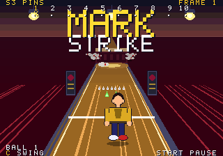
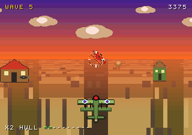
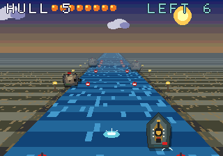
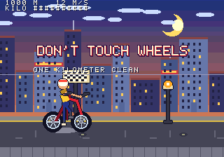
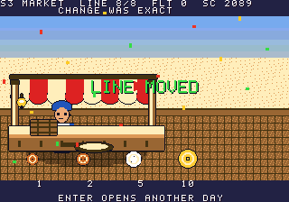

# s3games

S3-16 cartridges. Each one builds against the console in [s3rally](https://github.com/macncrash/s3rally).

```bash
git clone https://github.com/macncrash/s3rally.git
git clone https://github.com/macncrash/s3games.git
cd s3games/s3pins
S3_ENGINE="$PWD/../../s3rally/src" make
./s3pins
```

`S3_ENGINE` defaults to a `csys/s3rally` checkout two directories up. Point it at `s3rally/src` if your folders sit somewhere else.

## Play in the browser

The index is [web/index.html](web/index.html). On GitHub Pages that page is [macncrash.github.io/s3games](https://macncrash.github.io/s3games/).

Each link opens one cartridge. The page is a single file: script, wasm, and shell packed together. Build one with Emscripten:

```bash
./tools/make-web-asset.sh s3pins
```

`./tools/make-web-asset.sh --all` packs every cartridge and rewrites the index. A push to `main` runs that pack and publishes the pages site.

## A few of them






